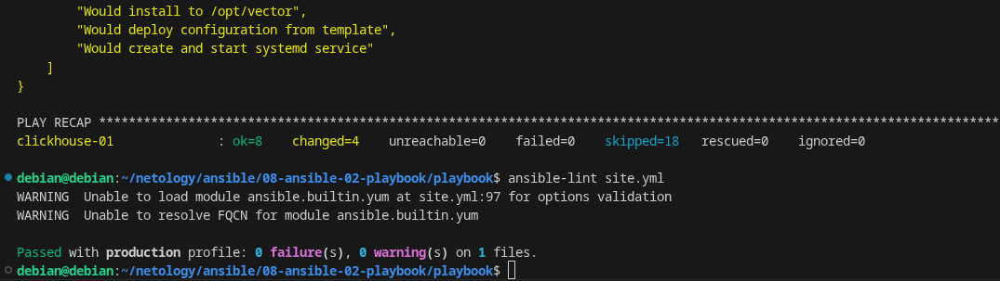
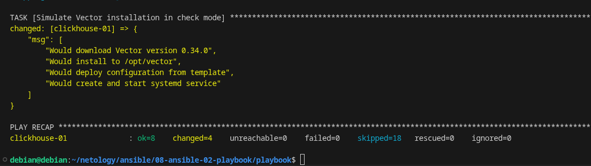
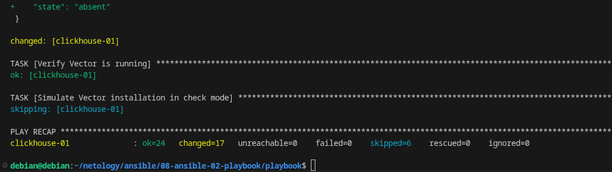

# Ansible Playbook: ClickHouse and Vector Installation

## 📋 Описание

Данный playbook выполняет автоматическую установку и настройку двух компонентов:
- **ClickHouse**
- **Vector**

Playbook предназначен для Red Hat-совместимых дистрибутивов (CentOS/RHEL/AlmaLinux/Rocky).

## 🔧 Параметры

### Переменные ClickHouse (group_vars/clickhouse.yml)
| Переменная | Описание | Значение по умолчанию |
|------------|----------|----------------------|
| `clickhouse_version` | Версия ClickHouse | `22.3.3.44` |
| `clickhouse_packages` | Список пакетов | `[clickhouse-client, clickhouse-server, clickhouse-common-static]` |

### Переменные Vector (определены в playbook)
| Переменная | Описание | Значение по умолчанию |
|------------|----------|----------------------|
| `vector_version` | Версия Vector | `0.34.0` |
| `vector_arch` | Архитектура | `x86_64` |
| `vector_install_dir` | Директория установки | `/opt/vector` |
| `vector_config_dir` | Директория конфигов | `/etc/vector` |
| `vector_data_dir` | Директория для данных | `/var/lib/vector` |

## 🎯 Теги

Playbook не использует теги, но разделен на два plays:
- `Install Clickhouse` - установка ClickHouse
- `Install Vector` - установка Vector

5️⃣ Запуск ansible-lint

$ ansible-lint site.yml

  

6️⃣ Запуск с флагом --check

$ ansible-playbook -i inventory/prod.yml site.yml --check

  

7️⃣ Первый запуск с --diff

$ ansible-playbook -i inventory/prod.yml site.yml --diff

  

8️⃣ Второй запуск с --diff (проверка идемпотентности)

$ ansible-playbook -i inventory/prod.yml site.yml --diff

  

